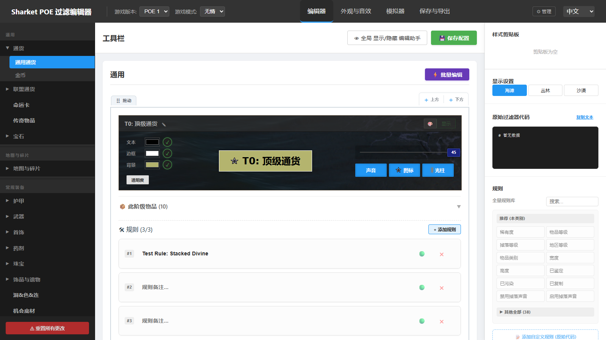
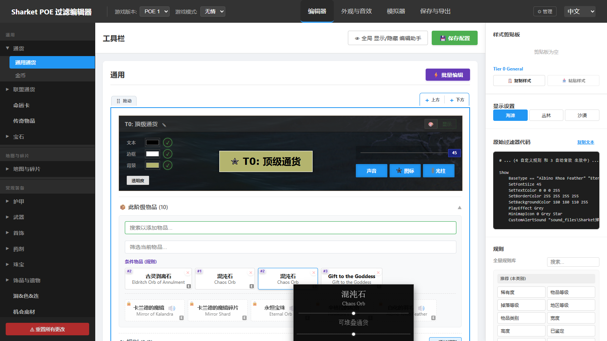
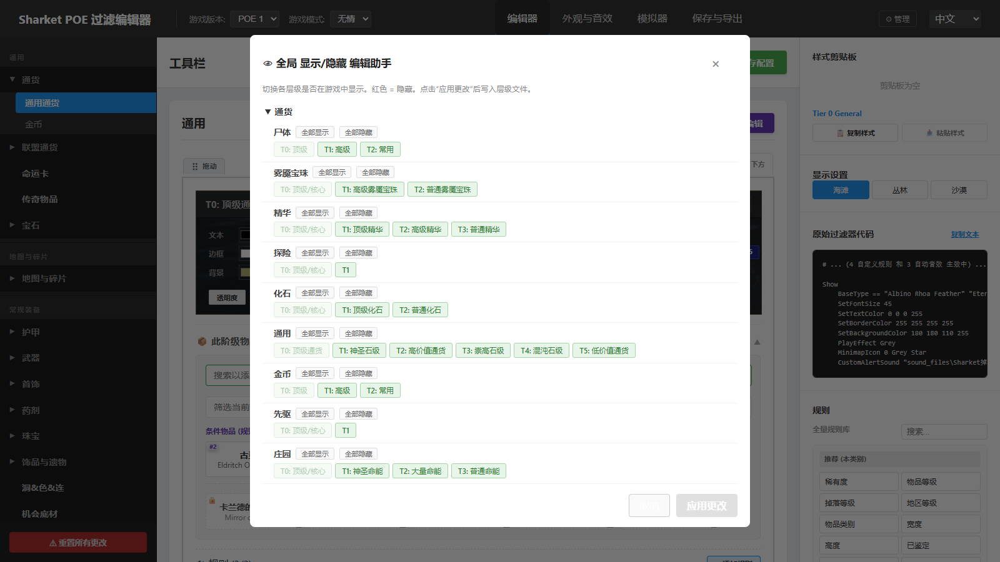
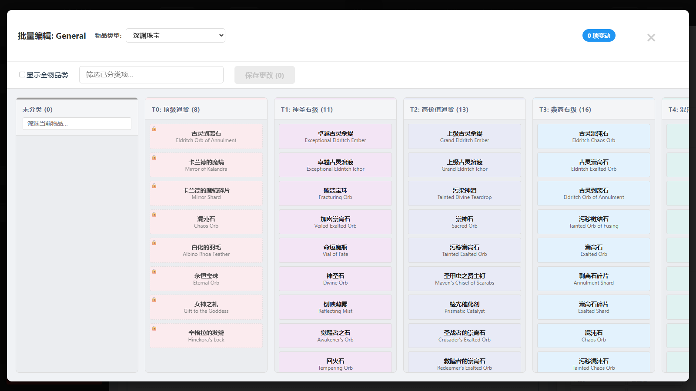
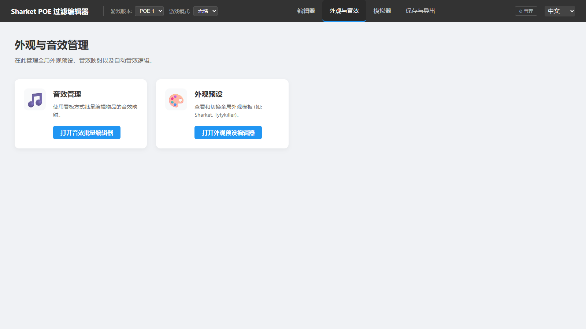
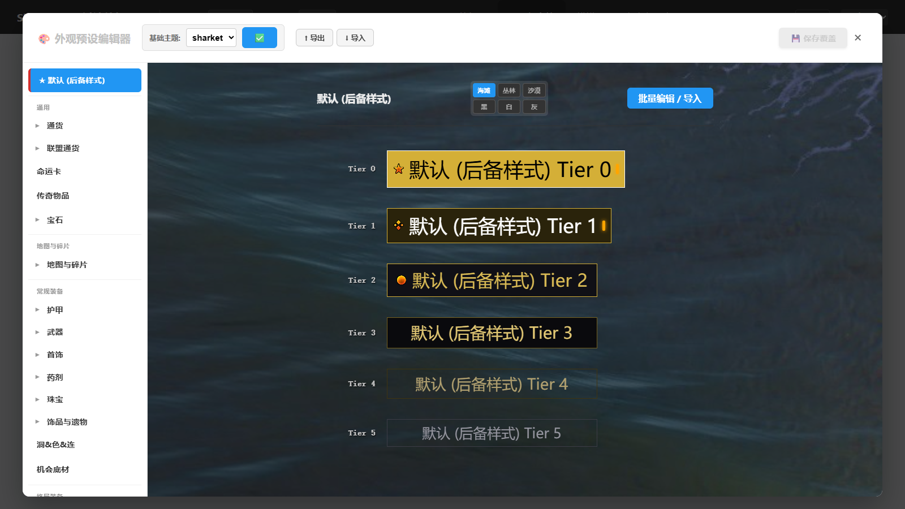
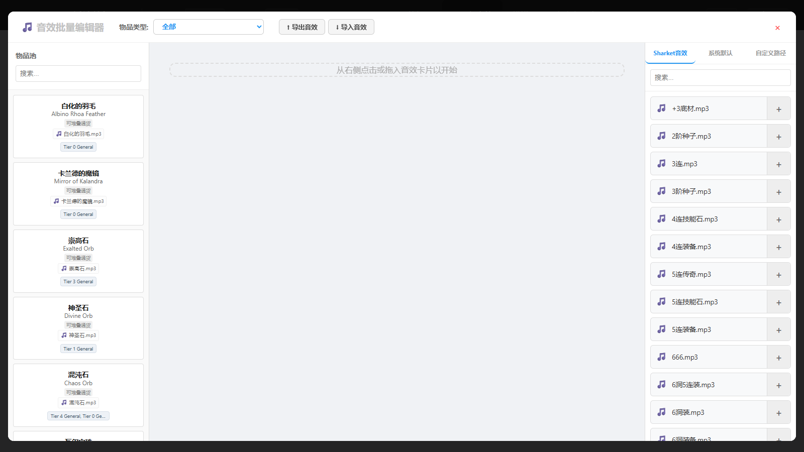
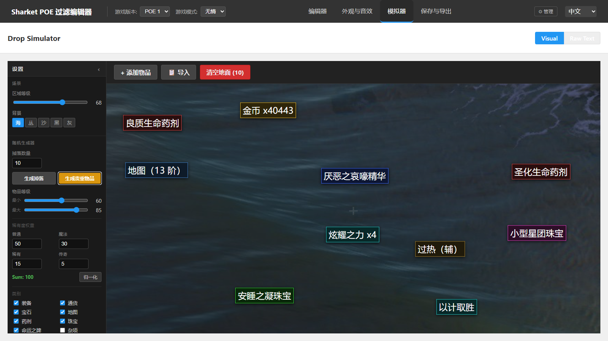
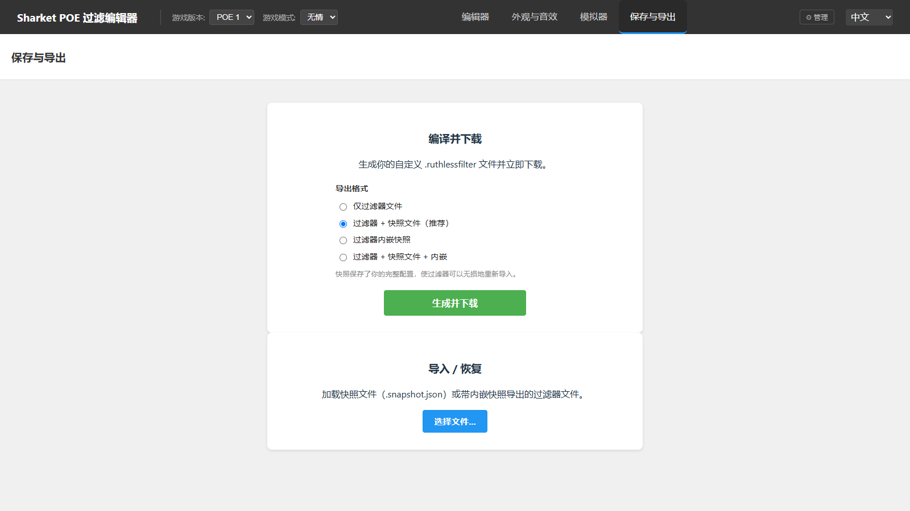

# Sharket POE 过滤编辑器 — 用户手册

> For the English version, see [USER_MANUAL_EN.md](USER_MANUAL_EN.md)

Sharket POE 过滤编辑器是一款免费的、纯浏览器端的《流放之路》(Path of Exile) 掉落过滤器编辑工具。你可以自定义哪些物品显示或隐藏、它们的外观（颜色、光柱、小地图图标）和提示音效，然后直接下载可用的 `.filter` 过滤器文件。

**在线地址：<https://sharketfilter.xyz>**

无需注册账号、无需安装。所有修改会自动保存在**你的浏览器**中（localStorage）。这意味着：

- 在同一台电脑、同一个浏览器中，刷新页面或重启浏览器后修改仍然保留。
- 清除网站数据（或换浏览器/换电脑）会丢失修改 —— 请定期使用 **保存与导出 → 过滤器 + 快照文件** 做备份（见 [保存与导出](#5-保存与导出)）。

---

## 目录

1. [顶部栏](#1-顶部栏)
2. [编辑器](#2-编辑器)
3. [外观与音效](#3-外观与音效)
4. [模拟器](#4-模拟器)
5. [保存与导出](#5-保存与导出)
6. [在游戏中安装过滤器](#6-在游戏中安装过滤器)
7. [小技巧与常见问题](#7-小技巧与常见问题)

---

## 1. 顶部栏

页面最上方的深色横栏始终可见：

- **游戏版本** —— POE 1 / POE 2。
- **游戏模式** —— 普通 或 无情 (Ruthless)。它决定导出文件的扩展名：普通为 `.filter`，无情为 `.ruthlessfilter`。
- **页面标签** —— **编辑器**、**外观与音效**、**模拟器**、**保存与导出**，即下文介绍的四个主页面。
- **语言选择**（最右侧）—— 随时在 **中文** 和 **English** 之间切换整个界面。

## 2. 编辑器

编辑器用来决定*每件物品属于哪个阶级（Tier）*，以及*每个阶级长什么样*。

### 导航（左侧边栏）

分类按章节分组（通用、地图与碎片、常规装备、终局装备、剧情）。点击分类（如 **通货**）展开，再点击具体文件（如 **通用通货**）打开。侧边栏底部的 **⚠ 重置所有更改** 会把一切恢复为默认 —— 无法撤销，不确定时请先导出快照。

### 阶级块（Tier Block）

每个分类是一条阶级阶梯，最顶端 (T0) 价值最高，越往下越低。每个阶级块提供：

- **实时预览条** —— 与游戏内完全一致的物品标签效果。
- **显示 / 隐藏开关**（块右上角）—— 把整个阶级从过滤器中隐藏。
- **✎ 重命名** —— 点击阶级名旁边的笔图标即可改名。只需用你的语言输入一个名字，两种语言会同时应用。
- **样式控制** —— 文本 / 边框 / 背景颜色（含透明度）、字号滑块，以及 **声音**、**图标**（小地图图标）、**光柱** 选择器。
- **🎨 快速样式** —— 一键把主题中的现成样式预设应用到该阶级。
- **排序** —— 拖动块上的拖动柄，或使用 **上方 / 下方** 按钮。

### 此阶级物品

点击 **📦 此阶级物品 (N)** 展开物品列表。在这里可以**把物品卡片拖到其他阶级**来重新分级。悬停物品会显示信息悬浮框：

悬浮框包含物品的类别和属性、**官方描述**（中文界面下显示中文）、掉落来源提示（首领 / 赛季机制等），对装备基底还会列出**该基底可能掉落的高价值传奇物品**，并标注掉落来源。

### 规则

物品列表下方，每个阶级有 **🛠 规则** 区域，用于精细条件（如"堆叠数量 ≥ 5"、"物品等级 ≥ 84"）。从右侧面板的**规则库**添加条件（稀有度、物品等级、掉落等级、插槽……），用绿点开关单条规则，也可以编写**自定义原始规则**实现特殊需求。

### 右侧面板

- **样式剪贴板** —— 复制某个阶级的样式，粘贴到另一个阶级。
- **显示设置** —— 切换预览背景（海滩 / 丛林 / 沙漠）。
- **原始过滤器代码** —— 当前分类实际生成的过滤器文本。

### 工具栏（阶级列表上方）

- **👁 全局 显示/隐藏 编辑助手** —— 在一个总览里查看*所有分类的所有阶级*，批量切换显示/隐藏，最后点击应用。修改在应用前只是暂存。

  

- **💾 保存配置** —— 保存当前分类的修改。

### ⚡ 批量编辑

**批量编辑** 按钮打开一个看板式面板：每一列是一个阶级，每张卡片是一件物品。在列之间拖动卡片即可快速重新分级。搜索框可以过滤物品；勾选**显示所有类别**可跨物品类别操作。修改会先暂存（右上角计数），点击**保存更改**后生效。

带**锁**图标的物品位于受保护的阶级（例如固定的 T0 顶级物品），无法移动。

## 3. 外观与音效

这个页面是全局外观和音效管理的入口：

### 外观预设编辑器

在一个界面里浏览所有分类的阶级样式，可以直接编辑、批量编辑多个阶级，还能**导出 / 导入主题文件**，在不同过滤器或朋友之间分享外观。

左侧列表与编辑器的分类一一对应；**Default (fallback)** 是没有单独设置的分类所使用的兜底样式。

### 音效批量编辑器

用拖放的方式给物品绑定提示音：左侧是**物品池**（可按物品类别筛选），右侧是**音效卡片**（Sharket 音效包 / 游戏默认音效 / 自定义音效）。把音效拖到物品上 —— 或把物品拖到音效上 —— 即可绑定。音效映射同样支持**导出 / 导入**文件。

## 4. 模拟器

模拟器以"所见即所得"的方式展示你的过滤器在游戏中的真实效果 —— 颜色、光柱、小地图图标和音效全部实时生效。

- **左侧设置面板** —— 区域等级、地面背景、掉落生成设置（物品类别、稀有度权重），然后点击 **生成掉落**（随机掉落）或 **生成贵重**（偏向高价值掉落）。
- **+ 添加物品** —— 手动构造一件特定物品（类别、基底、物品等级、稀有度、插槽……）并扔到地上。
- **📋 导入** —— 粘贴从游戏中复制的物品文本（游戏内对物品按 Ctrl+C），精确还原那件物品。
- **清空地面** —— 移除所有已掉落物品。
- **双击任意掉落物品**可以查看*它命中了哪个阶级和哪些规则*，并可一键跳转到编辑器中对应的阶级。
- 顶部 **视觉 / 文本** 开关可在地面视图和原始过滤器文本之间切换。

## 5. 保存与导出

### 编译并下载

选择**导出格式**，然后点击**生成并下载**：

| 格式 | 你会得到 |
|---|---|
| 仅过滤器 | 只有 `.filter` 文件 |
| **过滤器 + 快照文件（推荐）** | 过滤器 **加上** 一份 `.snapshot.json` 完整配置备份 |
| 内嵌快照的过滤器 | 一个内部嵌入了备份的 `.filter` 文件 |
| 过滤器 + 快照文件 + 内嵌 | 以上全部 |

**快照**是无损备份：之后导入它可以一比一恢复所有阶级、样式、音效和规则。每次大改之后都建议留一份。

### 导入 / 恢复

加载 `.snapshot.json`（或带内嵌快照的过滤器文件）。页面会列出检测到的文件清单，你可以**精确勾选要应用哪些部分** —— 例如只恢复通货的修改，或只恢复主题。

## 6. 在游戏中安装过滤器

1. 在**保存与导出**页面下载过滤器。
2. 把文件放进《流放之路》的过滤器文件夹：
   - **Windows：** `%USERPROFILE%\Documents\My Games\Path of Exile`
   - （普通模式文件名为 `Sharket_Custom.filter`；无情模式为 `Sharket_Custom.ruthlessfilter`。）
3. 进入游戏：**选项 → 游戏 → 界面 → 物品过滤器列表**，选择 *Sharket_Custom* 并确认。
4. 重新下载更新后的过滤器后，需要重新选择一次（或点过滤器列表旁的刷新图标）才会生效。

> 国服 (腾讯) 客户端的过滤器文件夹位置可能不同，请以客户端实际文档目录为准。

## 7. 小技巧与常见问题

**我的修改保存在哪里？** 在你的浏览器里。同一台电脑 + 同一个浏览器 = 修改一直都在。重要的配置请用**过滤器 + 快照文件**导出备份。

**改坏了怎么办？** 侧边栏底部 → **⚠ 重置所有更改**（不可撤销），或重新导入之前的快照。

**能分享我的配置吗？** 可以 —— 把 `.snapshot.json`（完整配置）、主题文件（仅外观）或音效文件（仅音效）发给别人，对方在保存与导出页面或对应编辑器中导入即可。

**下载的文件是 `.ruthlessfilter`，但我玩的是普通联盟。** 检查顶部栏的**游戏模式**下拉框 —— 生成前把它切换为*普通*。

**支持 POE 2 吗？** 顶部栏有 POE 2 选项；目前完整支持的主要目标是 POE 1。

**某个分类或物品看起来不对 / 缺失。** 请直接反馈给作者 —— 数据每个赛季都会重建，你的反馈非常有帮助。

---

*本手册中的截图由脚本自动从线上站点抓取（见本目录的 `capture_screenshots.mjs`）。界面更新后重新运行即可刷新截图。*
