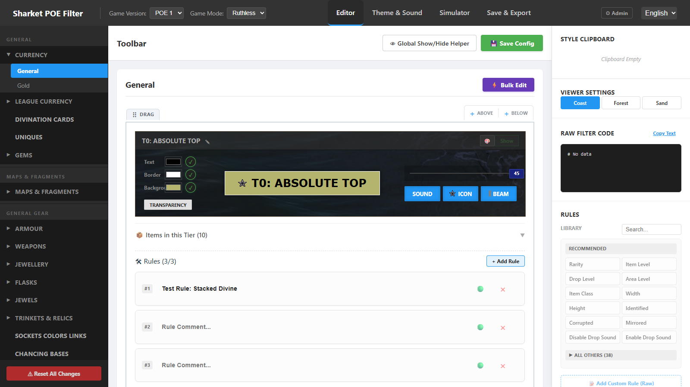
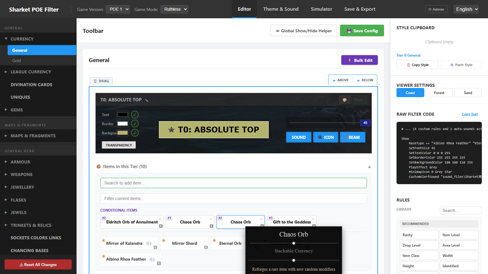
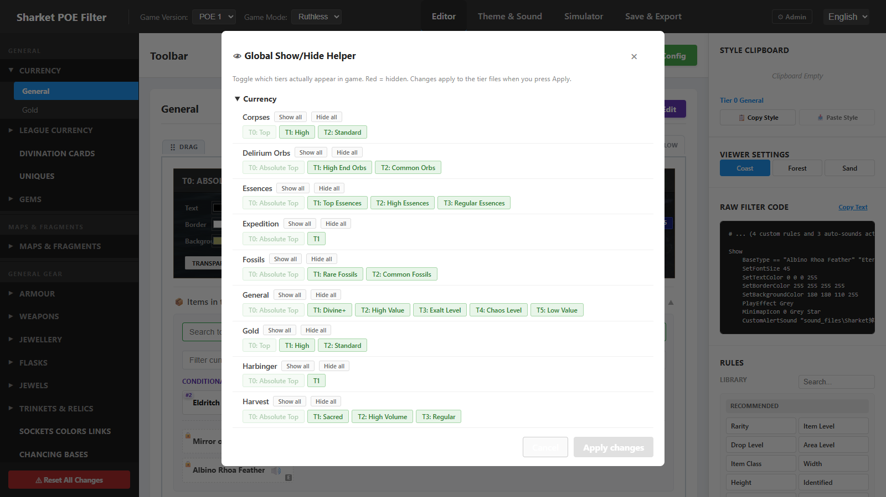
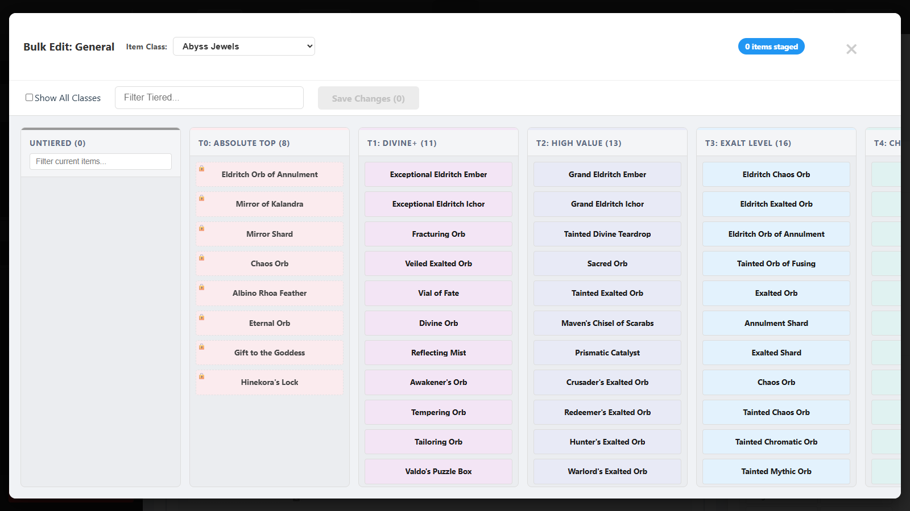
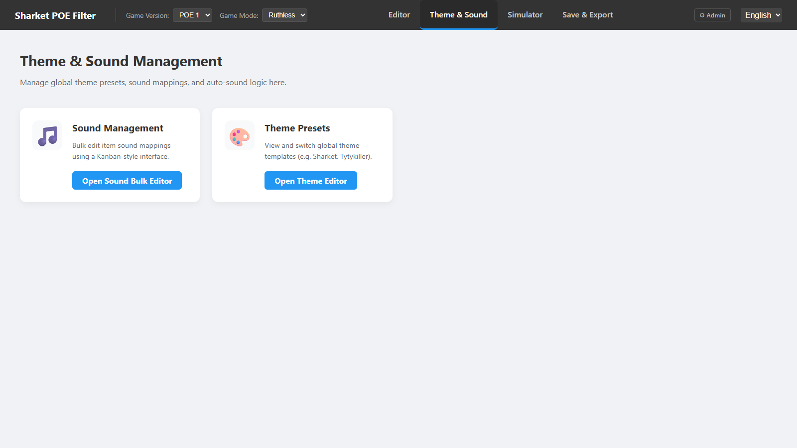
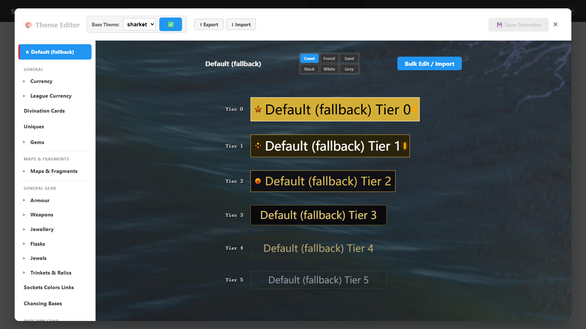
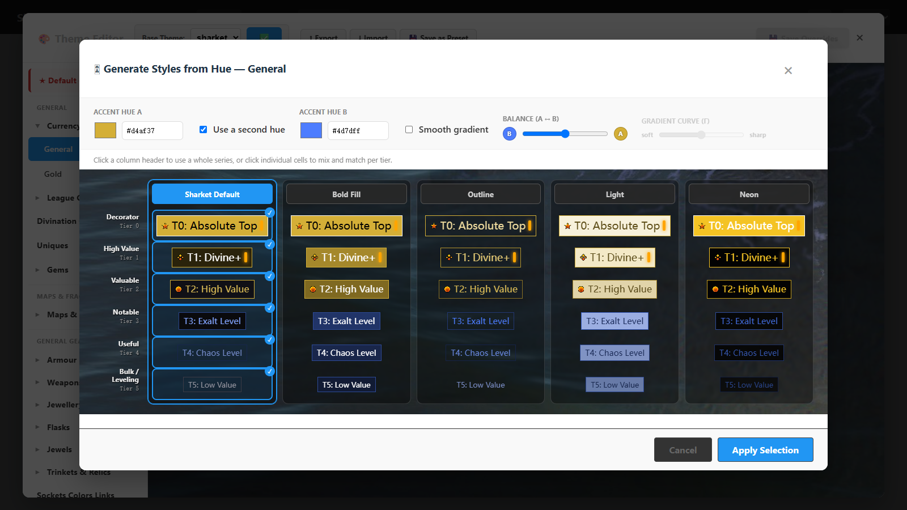
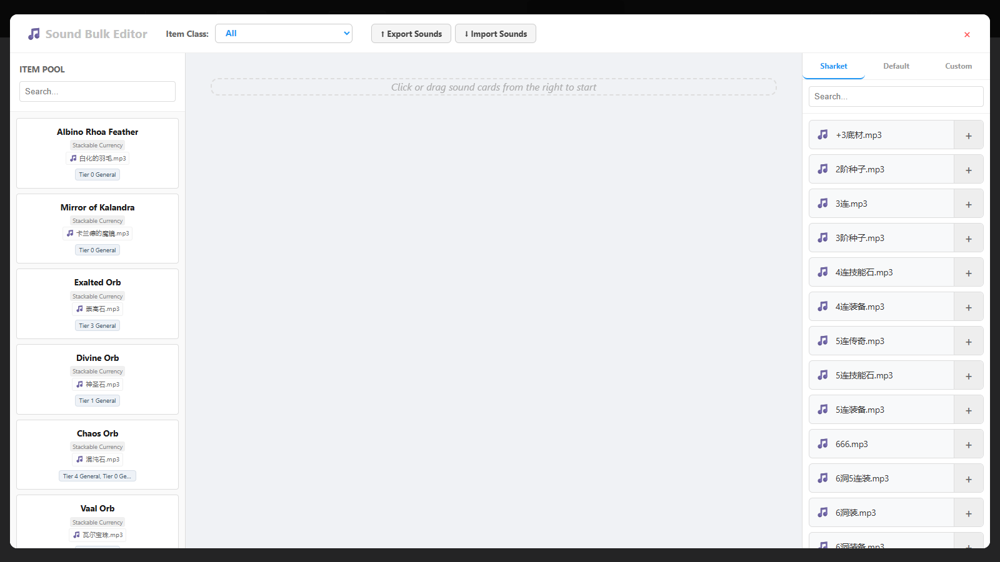
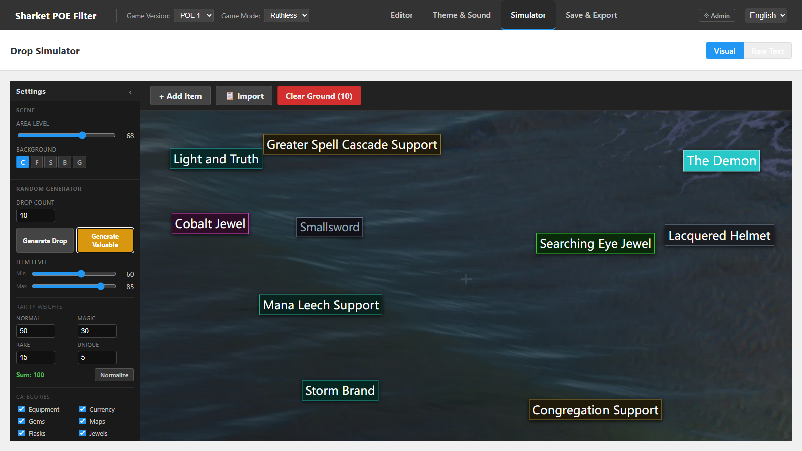
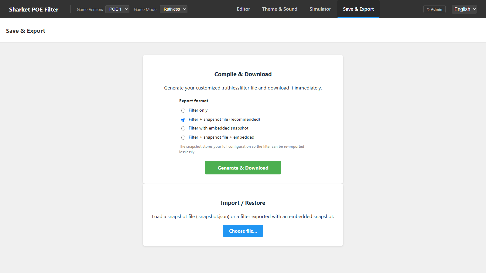

# Sharket POE Filter — User Manual

> 中文版请见 [USER_MANUAL_CH.md](USER_MANUAL_CH.md)

Sharket POE Filter is a free, browser-based loot-filter editor for Path of Exile. You can customize which items are shown or hidden, how they look (colors, beams, minimap icons), and how they sound — then download a ready-to-use `.filter` file.

**Live site: <https://sharketfilter.xyz>**

No account or installation is needed. Everything you change is saved automatically **in your browser** (localStorage). Two consequences:

- Your edits survive page reloads and browser restarts on the same computer/browser.
- Clearing site data (or switching browsers/computers) loses your edits — use **Save & Export → Filter + snapshot file** regularly as a backup (see [Save & Export](#5-save--export)).

---

## Table of Contents

1. [The top bar](#1-the-top-bar)
2. [Editor](#2-editor)
3. [Theme & Sound](#3-theme--sound)
4. [Simulator](#4-simulator)
5. [Save & Export](#5-save--export)
6. [Installing the filter in the game](#6-installing-the-filter-in-the-game)
7. [Tips & FAQ](#7-tips--faq)

---

## 1. The top bar

The dark bar at the very top is always visible:

- **Game Version** — POE 1 / POE 2.
- **Game Mode** — Normal or Ruthless. This decides the exported file extension: `.filter` for Normal, `.ruthlessfilter` for Ruthless.
- **View tabs** — **Editor**, **Theme & Sound**, **Simulator**, **Save & Export**. These are the four main pages described below.
- **Language selector** (far right) — switch the whole UI between **中文** and **English** at any time.

## 2. Editor

The Editor is where you decide *which tier each item belongs to* and *what each tier looks like*.

### Navigating (left sidebar)

Categories are grouped into chapters (General, Maps & Fragments, General Gear, Endgame Gear, Campaign). Click a category (e.g. **Currency**) to expand it, then click a file (e.g. **General**) to open it. The **⚠ Reset All Changes** button at the bottom of the sidebar restores everything to defaults — it cannot be undone, so export a snapshot first if unsure.

### Tier blocks

Each category is a ladder of tiers, best at the top (T0) and progressively less valuable below. Every tier block gives you:

- **Live preview strip** — exactly how the item label will look in game.
- **Show / Hide toggle** (top-right of the block) — hide a whole tier from your filter.
- **✎ Rename** — click the pen icon next to the tier name to rename it. You type one name in your own language; it is applied to both languages.
- **Style controls** — text / border / background colors (with transparency), font-size slider, and the **SOUND**, **ICON** (minimap icon) and **BEAM** (light beam) pickers.
- **🎨 Quick style** — apply a ready-made style preset from the theme to this tier in one click.
- **Reorder** — drag the block by its handle, or use the **Above / Below** buttons.

### Items in this Tier

Click **📦 Items in this Tier (N)** to expand the item list. From here you can **drag an item card onto another tier** to re-tier it. Hovering an item shows a rich tooltip:

The tooltip includes the item's class and stats, its **official description** (shown in Chinese when the UI language is Chinese), drop-source hints (boss / league mechanic / etc.), and — for equipment bases — **which valuable uniques the base could be**, each with a drop-source badge.

### Rules

Below the item list, each tier has a **🛠 Rules** section for fine-grained conditions (e.g. "Stack Size ≥ 5", "Item Level ≥ 84"). Add conditions from the **Rules library** in the right-hand panel (Rarity, Item Level, Drop Level, Sockets, …), toggle each rule on/off with the green dot, or write a **custom raw rule** for anything exotic.

### Right-hand panel

- **Style clipboard** — copy a tier's style and paste it onto another tier.
- **Viewer settings** — change the preview background (Coast / Forest / Sand).
- **Raw filter code** — the actual filter text generated for the open category.

### Toolbar (above the tier list)

- **👁 Global Show/Hide Helper** — one overview of *every* tier in *every* category. Toggle visibility en masse, then press Apply. Changes are staged until applied.

  

- **💾 Save Config** — saves your edits to the open category.

### ⚡ Bulk Edit

The **Bulk Edit** button opens a kanban-style board: each column is a tier, each card an item. Drag cards between columns to re-tier many items quickly. A search box filters the items; **Show All Classes** widens the board beyond the current item class. Changes are staged (counter at top-right) until you press **Save Changes**.

Items with a small **lock** are in protected tiers (e.g. pinned T0 chase items) and cannot be moved.

## 3. Theme & Sound

This page is the hub for global appearance and sound management:

### Theme Editor

Browse every category's tier styles in one place, edit them, bulk-edit several tiers at once, and **export / import theme files** to share looks between filters or with friends.

The left list mirrors the Editor's categories; **Default (fallback)** is the style used by any category without its own override.

### Hue Generator

Instead of hand-editing every tier's colors, let the app design the whole ladder for you. Select a category, press **🎛 Hue Generator**, and pick an accent color — the generator instantly proposes **5 complete style series** for that category, side by side:

| Series | Look |
|---|---|
| Sharket Default | The site's standard look — accent text/border on dark backgrounds |
| Bold Fill | Solid accent-filled backgrounds at every tier, loud and unmissable |
| Outline | No backgrounds at all — just accent text and a thin border, minimal noise |
| Light | Pale bright backgrounds with dark accent text ("white tag" style) |
| Neon | Glowing saturated colors on black |

- **Mix & match** — click a series' header button to use the whole column, or click individual cells to combine series per tier (e.g. Bold Fill for the top tier, Outline for the bulk tiers).
- **Second hue** — tick *Use a second hue* to give the top tiers one color and the lower tiers another; the **Balance** slider decides where the handoff happens.
- **Smooth gradient** — tick this and the two hues blend smoothly down the ladder instead of switching in bands. **Balance** then shifts the blend midpoint, and the **Gradient curve (γ)** slider makes the transition softer or sharper.
- **Apply Selection** writes the result into your overrides for that category (your alert **sounds are never touched**) — save with the normal 💾 button.

### Save your look as a preset

The **💾 Save as Preset** button (next to Export/Import in the Theme Editor header) snapshots the current base theme **plus all your edits** into a new named preset. Untouched categories are copied from the base theme, so the preset is always complete. After saving you can optionally switch your base theme to the new preset — the look stays identical, and your override layer is cleared for a fresh start.

### Sound Bulk Editor

Map alert sounds to items with drag & drop: the **item pool** on the left (filterable by item class), **sound cards** on the right (Sharket pack / game Default sounds / your Custom sounds). Drop a sound onto an item — or an item onto a sound — to bind them. Sound mappings can also be **exported / imported** as a file.

## 4. Simulator

The Simulator shows your filter exactly as it will look in game — colors, beams, minimap icons and sounds are all live (WYSIWYG).

- **Left settings panel** — area level, ground background, and drop-generator settings (which item classes, rarity weights). Then press **Generate Drop** (random loot) or **Generate Valuable** (bias toward good drops).
- **+ Add Item** — hand-craft a specific item (class, base type, item level, rarity, sockets, …) and drop it.
- **📋 Import** — paste an item copied from the game (Ctrl+C on an item in PoE) to drop exactly that item.
- **Clear Ground** — remove all dropped items.
- **Double-click any dropped item** to see *which tier and rules matched it* — and jump straight to that tier in the Editor.
- The **Visual / Text** toggle at the top switches between the ground view and the raw filter text.

## 5. Save & Export

### Compile & Download

Pick an **export format**, then press **Generate & Download**:

| Format | What you get |
|---|---|
| Filter only | Just the `.filter` file |
| **Filter + snapshot file (recommended)** | The filter **plus** a `.snapshot.json` backup of your full configuration |
| Filter with embedded snapshot | One `.filter` file with the backup embedded inside it |
| Filter + snapshot file + embedded | All of the above |

The **snapshot** is a lossless backup: importing it later restores every tier, style, sound and rule exactly. Keep one whenever you've done significant editing.

### Import / Restore

Load a `.snapshot.json` (or a filter with an embedded snapshot). You'll see the list of detected files and can **select exactly which parts to apply** — e.g. restore only your Currency edits, or only the theme.

## 6. Installing the filter in the game

1. Download the filter from **Save & Export**.
2. Move the file into your Path of Exile filter folder:
   - **Windows:** `%USERPROFILE%\Documents\My Games\Path of Exile`
   - (Normal mode uses `Sharket_Custom.filter`; Ruthless uses `Sharket_Custom.ruthlessfilter`.)
3. In game: **Options → Game → UI → List of Item Filters**, select *Sharket_Custom* and confirm.
4. After re-downloading an updated filter, re-select it (or press the refresh icon next to the filter list) to reload.

## 7. Tips & FAQ

**Where is my work saved?** In your browser. Same computer + same browser = your edits are there. For anything you care about, export **Filter + snapshot file** as a backup.

**I broke something — how do I start over?** Sidebar bottom → **⚠ Reset All Changes** (irreversible), or re-import an earlier snapshot.

**Can I share my setup?** Yes — send someone your `.snapshot.json` (full config), a theme file (looks only) or a sound file (sounds only); they can import it on the Save & Export page or in the Theme / Sound editors.

**The downloaded file is named `.ruthlessfilter` but I play normal leagues.** Check the **Game Mode** dropdown in the top bar — set it to *Normal* before generating.

**Does it work for POE 2?** A POE 2 option exists in the top bar; POE 1 is the primary, fully supported target right now.

**Some category or item looks wrong / missing.** Please report it to the author — the data is rebuilt every league and feedback helps a lot.

---

*Screenshots in this manual were captured automatically from the live site (see `docs/manual/capture_screenshots.mjs` in the repository). Re-run it after UI changes to refresh them.*
